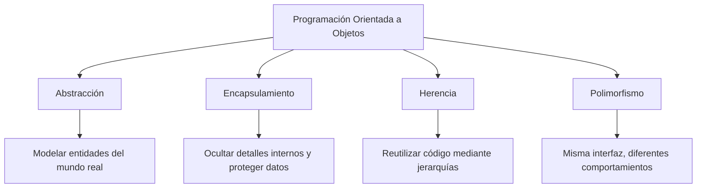

## 🧠 Los 4 Pilares de la POO



### Resumen de Conceptos Clave

| Concepto | Descripción |
| :--- | :--- |
| **Objeto** | Instancia concreta de una clase con valores específicos. |
| **Clase** | Plantilla o molde para crear objetos. Define sus atributos y métodos. |
| **Encapsulamiento** | Restricción del acceso directo a los datos internos (`private`, `protected`, `public`). |
| **Abstracción** | Ocultamiento de la complejidad del sistema mostrando solo lo necesario. |
| **Herencia** | Capacidad de una clase de derivar características de otra clase base. |
| **Polimorfismo** | Capacidad de diferentes clases de responder al mismo método de forma distinta. |

---

## 📋 Lista de Objetivos / Checklist

- [x] Entender la diferencia entre programación estructurada y POO.
- [x] Crear primeras clases, constructores y métodos.
- [ ] Dominar la visibilidad de atributos (getters y setters).
- [ ] Aplicar Herencia y sobreescritura de métodos.
- [ ] Practicar Polimorfismo con clases abstractas e interfaces.
- [ ] Resolver ejercicios integradores de la vida real.

---

## 💻 Entorno y Tecnologías Usadas

* **Lenguaje:** *(Ej. PHP / Python / Java)*
* **Editor:** Visual Studio Code
* **Entorno:** Docker / CLI

---

## 📝 Notas y Apuntes Rápidos

> [!TIP]
> **Regla de oro:** Si varios objetos comparten el mismo comportamiento o atributos, evalúa aplicar **Herencia** o **Composición** para evitar duplicar código (DRY - *Don't Repeat Yourself*).

> [!NOTE]
> Recuerda mantener una responsabilidad única por clase para que el código sea limpio y mantenible.

---

## 🚀 Cómo ejecutar los ejemplos

1. Clona este repositorio:
   ```bash
   git clone [https://github.com/tu-usuario/poo-aprendizaje.git](https://github.com/tu-usuario/poo-aprendizaje.git)
   ```
2. Accede al directorio del proyecto:
   ```bash
   cd poo-aprendizaje
   ```
3. Ejecuta cualquiera de los scripts según la carpeta requerida.

---
*Organizado y mantenido durante mi proceso de aprendizaje.*